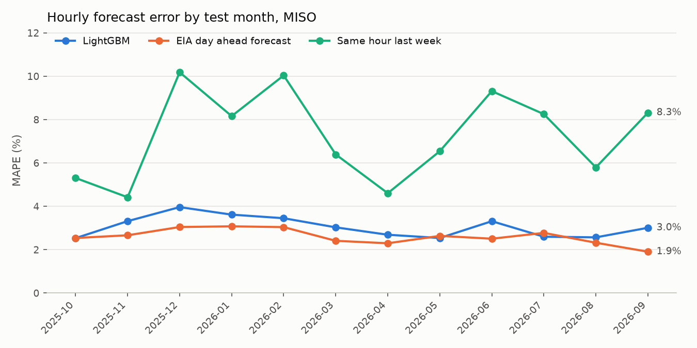

# MISO Electricity Demand Forecaster

[](https://github.com/austi20/miso-demand-forecaster/actions/workflows/tests.yml)

Can a small gradient boosting model forecast tomorrow's hourly electricity demand on the MISO grid, which covers Michigan and 14 other states, better than the grid operator's own day ahead forecast?

## What I found

No. Over a 12 month walk forward backtest (October 2025 through September 2026, 8,664 hours), my LightGBM model missed by 3.05% per hour on average (MAPE). The day ahead forecast MISO reports to EIA missed by 2.60%. The model beat it in 3 of the 12 months, and one of those by 0.01 points. Month by month, the gap ran from the model ahead by 0.18 points (July 2026) to EIA ahead by 1.10 points (September 2026).

Both are far better than the naive guess of "same hour last week," which missed by 7.28%.

## Live status

<!-- status:start -->
No drift. Last scored day 2026-10-07. 14 day MAPE: LightGBM 2.20%, EIA 1.30%. Backtest LightGBM was 3.05%. 0 of 14 scored days were forecast live, the rest replayed.
<!-- status:end -->

## What I expected and did not get

I expected the weather to be the excuse. My model only sees a temperature forecast made 48 hours ahead, so I also scored it with the temperature that actually happened, which no real forecaster has. Even with perfect weather it missed by 2.82%, still behind EIA's 2.60%. Pooled over the year, perfect weather closes about half the gap, but the effect is not steady: it helped in 8 months, hurt in 3 and tied in 1.

Part of what weather costs is a mismatch between sources. The forecast temperatures run 1.1 F warmer than the observed ones over the test year, and 2.8 F warmer in October 2025. The model learned on observed temperatures, so it sees a slightly warmer day than the one it was trained to recognize. The rest of the gap I can only guess at: four cities stand in for 15 states, and the newest demand the model sees is 48 hours old. I have not tested either.

## The numbers

| Method | MAPE | MAE (MWh) |
|---|---:|---:|
| EIA day ahead forecast | 2.60% | 2,019 |
| LightGBM, observed weather (not a fair forecast) | 2.82% | 2,219 |
| **LightGBM, 48 hour weather forecast** | **3.05%** | **2,394** |
| Same hour last week | 7.28% | 5,767 |



| Test month | LightGBM | EIA | Same hour last week |
|---|---:|---:|---:|
| 2025-10 | 2.53% | 2.54% | 5.31% |
| 2025-11 | 3.32% | 2.67% | 4.42% |
| 2025-12 | 3.96% | 3.05% | 10.18% |
| 2026-01 | 3.62% | 3.08% | 8.16% |
| 2026-02 | 3.45% | 3.04% | 10.04% |
| 2026-03 | 3.03% | 2.41% | 6.39% |
| 2026-04 | 2.69% | 2.30% | 4.61% |
| 2026-05 | 2.54% | 2.64% | 6.54% |
| 2026-06 | 3.31% | 2.51% | 9.31% |
| 2026-07 | 2.60% | 2.78% | 8.25% |
| 2026-08 | 2.57% | 2.32% | 5.80% |
| 2026-09 | 3.01% | 1.91% | 8.32% |

The model trails EIA most in December, June and September, by 0.8 to 1.1 points. Same hour last week is worst in December, February and June, above 9% in each.

Every number above is in [results/backtest.csv](results/backtest.csv), with MAE and the hour count for each month. I commit that file and the chart so the table can be checked without an API key. Every run is also logged to MLflow (see How to run).

## How it works

The forecast for a Central time day is made the morning before. So every input has to be known 48 hours before the hour it predicts. That rules out "same hour yesterday": for 11 pm tomorrow, 11 pm today has not happened yet when the forecast is made.

The model is LightGBM with fixed settings (500 trees, learning rate 0.05) and six features:

- demand 48 hours earlier and 168 hours (one week) earlier
- hour of day and day of week, in Central time
- a holiday flag for the six NERC holidays (New Year's, Memorial Day, July 4th, Labor Day, Thanksgiving, Christmas; one that falls on a Sunday moves to Monday)
- the average temperature across four cities

I left out heating and cooling degree hours. A tree splits on temperature directly, so `max(65 - temp, 0)` gives it nothing new.

The backtest is walk forward. For each of the last 12 complete months, the model trains on everything before the last day of the previous month and then forecasts every hour in the test month. That last day is held out because the forecast for the 1st is made on the morning of that day, before it has finished. The model trains on observed temperature and is scored on the temperature that was forecast 48 hours ahead, the way it would run for real.

All three methods are scored on the same hours. Hours where EIA has no forecast are dropped for everyone.

I fixed the features and settings before the first backtest run and did not tune them after seeing the results. Tuning against the test months would make the comparison with EIA meaningless. The one change since was a bug fix: my first holiday rule moved Saturday holidays to Friday, which NERC does not do. It moved July and August by less than 0.1 points and left the overall numbers the same.

## The nightly pipeline

`.github/workflows/nightly.yml` runs on GitHub Actions at 12:00 UTC every day, which is 6 or 7 am Central. It does four things:

1. Rebuilds the three parquet files from the APIs.
2. Retrains the model on everything known by this morning and forecasts all of tomorrow, using the same six features as the backtest. The forecast goes into `metrics/forecasts.csv` and is never overwritten.
3. Scores every stored forecast whose day now has a full 24 hours of actual demand. EIA's forecast and same hour last week are scored on the same hours. The results go into `metrics/daily_scores.csv`.
4. Compares the last 14 scored days with the backtest. If the 14 day LightGBM MAPE is more than 50% above the backtest's 3.05%, the Live status section at the top of this README says so. Until 14 days are scored it reports how many it has.

The workflow commits `metrics/` and the status line back to the repo, so the history of live scores is the git log.

The first 14 scored days (2026-09-24 to 2026-10-07) are replays, marked `replay` in the `source` column. I ran the same code for those past days on the day I built the pipeline. Each replay model trains only on data before that day, and uses the temperature forecast made 48 hours ahead, but the demand history is the revised data as of today, not what was on the site that morning. Live rows are marked `live`. The status line counts both.

## The data

- **Demand and the day ahead forecast** come from the [EIA Open Data API v2](https://www.eia.gov/opendata/), route `electricity/rto/region-data`, which serves Form EIA-930 hourly data. `src/pull_eia.py` pulls types `D` (demand) and `DF` (day ahead forecast) for `respondent=MISO` from 2023-01-01 to the current hour, about 66,000 rows at 5,000 rows per call.
- **Observed temperature** comes from the [Open-Meteo Historical Weather API](https://open-meteo.com/en/docs/historical-weather-api), hourly 2 m temperature for Detroit, Chicago, Minneapolis and St. Louis averaged into one series.
- **Forecast temperature** comes from the [Open-Meteo Previous Runs API](https://open-meteo.com/en/docs/previous-runs-api), same four cities, from 2025-01-01. It stores what weather models predicted for each hour at fixed lead times.

Things that were easy to get wrong:

- **Time zones.** EIA offers `hourly` (UTC) and `local-hourly`. I pull UTC, so the November daylight saving hour never shows up twice. Calendar features and test months are built from Central time.
- **Paging.** The API returns at most 5,000 rows per call and says so only in a warning. The pull sorts on period and type so that paging by offset cannot skip or repeat rows, and it fails loudly if any hour comes back twice.
- **Future weather.** Both Open-Meteo endpoints fill hours that have not happened yet with forecast values. The pull drops anything after the current hour.
- **Forecast lead time.** The Previous Runs API offers `temperature_2m_previous_day1`, the value predicted 24 hours before the hour. That is too fresh: for 11 pm tomorrow it was made at 11 pm today, after the morning deadline. I use `previous_day2`, made 48 hours before, to match the demand lags.

The [data audit notebook](notebooks/01_data_audit.ipynb) checks for missing hours, duplicated hours and outliers. No hour is missing from the UTC grid. Demand is missing for one full day (2024-07-01) and the EIA forecast for five full days, each running midnight to midnight Central Standard Time. Four of those five fall in the test year (2026-03-20, 2026-04-27, 2026-08-02 and 2026-08-06), which is why the backtest scores 8,664 hours instead of 8,760. The most extreme hours all trace back to heat waves, cold snaps and holidays, so nothing was dropped.

The parquet files are not committed. One command rebuilds all three.

## How to run

```bash
python -m venv .venv
source .venv/bin/activate   # Windows: .venv\Scripts\activate
pip install -r requirements.txt
cp .env.example .env        # then add a free key from https://www.eia.gov/opendata/
python -m src.build_data
python -m src.backtest
python -m src.nightly
pytest
```

`python -m src.build_data` writes `data/raw/eia_miso.parquet`, `data/raw/weather_miso.parquet` and `data/raw/weather_forecast_miso.parquet`. It takes about a minute.

`python -m src.backtest` runs the 12 folds, writes `results/backtest.csv` and `results/backtest.png`, and logs one parent run plus one nested run per method to a local MLflow store. `python -m src.nightly` makes tomorrow's forecast, scores finished days and updates the status line. Add `--replay-days 14` to forecast and score the last 14 days as if they were live.

To browse the MLflow runs:

```bash
mlflow ui --backend-store-uri sqlite:///mlflow.db
```

## What would break this

- EIA-930 data is preliminary and gets revised. The "actual" demand for a given hour can change after a later pull, and so can every score above.
- Four city temperatures are a rough proxy for a footprint covering 15 states. None of the four is in MISO South (Louisiana, Arkansas, Mississippi, east Texas), and the plain average weights Minneapolis the same as Chicago.
- The model trains on reanalysis temperature and is scored on a weather model's forecast, and the two disagree: the forecast runs 1.1 F warm over the test year, with an average absolute gap of 2.2 F. Scoring on observed weather instead flatters the model by 0.23 points of MAPE (2.82% vs 3.05%).
- I do not know exactly when MISO's day ahead forecast is issued or what it knows at that time. If it is made later than the morning before, the comparison favors EIA.
- The drift check compares 14 days with a 12 month average. A mild October week and a January cold snap have very different baseline errors, so the check can fire on weather alone. The backtest months range from 2.5% to 4.0%.
- One year of test months is 12 numbers. The model losing 9 of 12 is a clear result, but the size of the gap could move with a different year.

## What I would do next

- Train on forecast temperatures instead of observed ones, so training and scoring see the same source.
- Add temperatures from MISO South and weight cities by load instead of a plain average.
- Log the nightly retrain to MLflow too. Right now the live scores are in a CSV and MLflow only holds the backtest.
